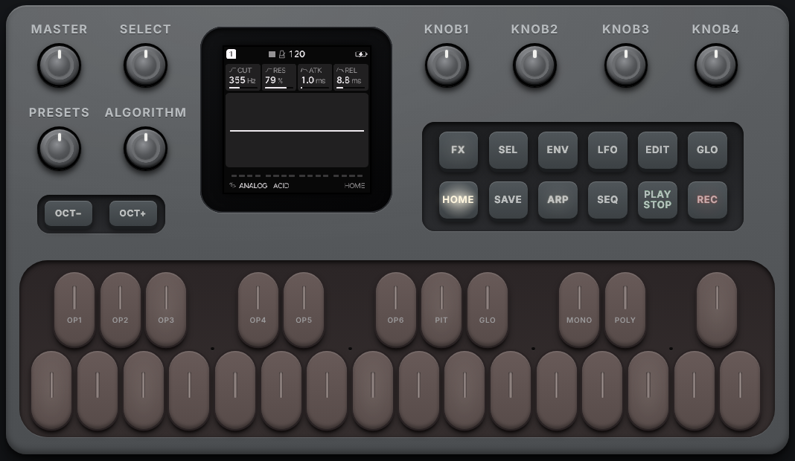
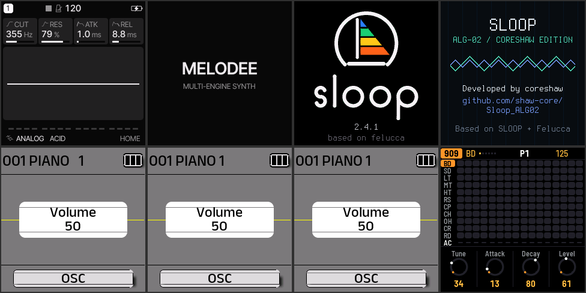

# M-VAVE FM-1 — эмулятор в браузере

[English](README.md) · **Русский**

**Открыть эмулятор:** https://shcherbakov7.github.io/m-wave-fm1-browser-emulator/

Эмулятор синтезатора **M-VAVE FM-1**, который запускает **немодифицированные
прошивки** (`.fwsc`, `.ufw`, а также `.bin`/`.elf`) прямо в браузере. Он
эмулирует процессор JieLi AC791N (набор инструкций pi32v2, два ядра) и
периферию платы: экран 240×240, клавиатуру из 27 клавиш и 14 кнопок, аудио,
USB, флеш-память. Ядро написано на Rust и собирается в WebAssembly.





## Совместимость

Проверено на 1,5 млрд инструкций без ошибок, с выводом интерфейса на экран
(в сборке WebAssembly с JIT):

| Прошивка | Статус |
|---|---|
| Официальная V13, V14, V15 (`FM-1.fwsc`) | загружается, экран, звук, кнопки |
| Felucca 1.1.5.1 | загружается, интерфейс, звук, USB-консоль, кнопки |
| SLOOP 2.4.1 | загружается до заставки и далее |
| SLOOP ALG-02 (ALG05-TEST) | загружается до заставки и далее |
| X0X 0.10.3-beta | загружается, интерфейс секвенсора |
| Melodee 0.13.1 | загружается до заставки и далее |

Не проверялись (нет файлов): Baud Girl FM-1+VA, Groove OS (платная),
Jangada, ChoralRoot, FiMba и другие. Если прошивка остановится, эмулятор
покажет адрес и причину. Пришлите их в issue.

## Как пользоваться

1. Откройте страницу эмулятора (GitHub Pages, см. ниже) или запустите локально.
2. Выберите прошивку в списке **«Выбрать прошивку…»**: там последние
   версии открытых прошивок (Felucca, SLOOP, X0X, Melodee, FoMni, Jangada,
   ChoralRoot, FiMba, fm1-nes, SLOOP ALG) и
   официальная M-VAVE. Ссылка вида `…/?fw=felucca` сразу открывает нужную
   прошивку. Свой файл `.fwsc` можно открыть кнопкой **«Свой файл»** или
   перетащить на панель; он попадёт в группу «Ваши файлы».

   Открытые прошивки (GPL-3.0) сборка сайта берёт из репозиториев их авторов
   (`tools/update-firmware.mjs`), проверяет каждую в эмуляторе
   (`tools/check-firmware.mjs`, результат виден на странице) и обновляет
   ежедневно. Официальная прошивка
   проприетарная, поэтому сайт её не хранит, а скачивает с сервера M-VAVE;
   если сервер не разрешит это браузеру, страница даст ссылку на файл.
3. Панель повторяет FM-1: все 14 кнопок, 27 клавиш и 8 ручек работают.
   Кнопки и клавиши нажимаются мышью или касанием (по клавишам можно вести
   пальцем). Ручки крутятся перетаскиванием вверх/вниз, колёсиком мыши или
   стрелками после Tab. MASTER — громкость (потенциометр), SELECT, PRESETS,
   ALGORITHM и KNOB 1–4 — энкодеры, как в устройстве. Подсветка кнопок и
   клавиш повторяет светодиоды. Клавиатура компьютера: `Z`…`/` и
   `S D F H J L ;` — клавиши с F3, `1 Q…Y 3 4 6` — верхняя часть, `←`/`→` —
   OCT−/OCT+, `Esc` — HOME, пробел — PLAY/STOP.
4. Кнопка **«Звук»** включает вывод звука. Загруженные прошивки запоминаются
   в браузере (список «Недавние»).
5. Язык интерфейса (английский или русский) переключается кнопками
   **EN / RU** в шапке и запоминается; ссылка с `?lang=ru` сразу открывает
   русскую версию.

## Ограничения

- **Скорость.** Эмулятор идёт в такт реальному времени и никогда не
  обгоняет устройство; если компьютер не успевает, эмуляция замедляется
  (строка «% реального» под экраном, во всплывающей подсказке — загрузка).
  Замеры в Chromium на медленном серверном процессоре (Xeon 2,1 ГГц, одно
  ядро): SLOOP ≈ 50%, Felucca ≈ 52%, официальная V15 ≈ 42% реальной скорости.
  На современном настольном процессоре ожидается примерно вдвое больше.
  Официальная прошивка тяжелее всех: она обслуживает матрицу кнопок и
  светодиодов прерыванием на каждые 1–2 байта SPI (десятки тысяч прерываний
  в секунду).
- USB MIDI с компьютера, Bluetooth и установка прошивки «по воздуху»
  (через эмулированный апдейтер) не поддерживаются.
- Для неподтверждённых на железе случаев (деление на ноль во float и т.п.)
  используется стандартное поведение IEEE 754.

## Сборка и запуск локально

Нужны Rust (с целью `wasm32-unknown-unknown`) и Python или Node.js для
статического сервера:

```sh
rustup target add wasm32-unknown-unknown
tools/build-web.sh                  # собирает web/fm1.wasm
python3 -m http.server -d web 8080  # затем откройте http://localhost:8080
```

Тесты и инструменты:

```sh
cargo test --release --manifest-path emulator/Cargo.toml
# Нативная диагностика прошивки: где остановилась, что на экране
cargo run --release --manifest-path emulator/Cargo.toml --example diagnose -- FIRMWARE.fwsc 300000000
FM1_LCD_PPM=screen.ppm cargo run --release ... --example diagnose -- FIRMWARE.fwsc 300000000
# Скорость и состав инструкций
PROFILE_OPS=1 cargo run --release --manifest-path emulator/Cargo.toml --example profile -- FIRMWARE.fwsc
# Проверка в настоящем Chromium (npm install для Playwright);
# SETTLE=40 — ещё 40 с работы после загрузки и замер скорости
node tools/browser-smoke.mjs FIRMWARE.fwsc screenshot.png
# WebAssembly-сборка в Node: скорость, экран, проверка JIT
node tools/wasm-smoke.mjs web/fm1.wasm FIRMWARE.fwsc 1000000000 screen.png
# Ручки, кнопки и светодиоды: в Node и в Chromium
node tools/panel-check.mjs web/fm1.wasm FIRMWARE.fwsc
node tools/browser-panel.mjs FIRMWARE.fwsc screenshot.png
# Где прошивка проводит время, какой код генерирует JIT
cargo run --release --manifest-path emulator/Cargo.toml --example hotspots -- FIRMWARE.fwsc
```

## Публикация на GitHub Pages

Workflow `.github/workflows/ci.yml` прогоняет тесты, собирает WebAssembly и
публикует сайт из ветки по умолчанию. Один раз включите в настройках
репозитория: **Settings → Pages → Source: GitHub Actions**.

## Устройство

```
web/                     страница, Web Worker с эмулятором, AudioWorklet
emulator/core/           ядро: CPU pi32v2, шина, периферия FM-1, загрузчик .fwsc
emulator/wasm/           C-ABI обёртка ядра для браузера
emulator/fixtures/       маленькие тестовые прошивки из upstream
tools/                   сборка, проверки в Node и Chromium
```

Эмулятор работает в Web Worker и привязан к часам: каждый отрезок (до 8 мс)
доводит время устройства до текущего момента, а если эмулятор впереди, он
ждёт. Между отрезками обрабатываются нажатия, отправляются кадры экрана (до
60 к/с), а звук идёт напрямую из воркера в AudioWorklet с задержкой около
40 мс.

Скорость даёт JIT: горячий код прошивки (и из флеша, и из SRAM) переводится
в модули WebAssembly, которые браузер компилирует в машинный код. Регионы
до 16 базовых блоков хранят регистры в локальных переменных, не вычисляют
флаги, которые сразу перезаписываются, и переходят друг в друга хвостовыми
вызовами без возврата в диспетчер. Всё, что трогает периферию, выполняет
интерпретатор. Каждая трансляция сверяется с интерпретатором в
дифференциальных тестах (`cargo test`), а режим `VERIFY=1 node
tools/wasm-smoke.mjs …` проверяет блоки прямо на прошивке.

Пока ядро ждёт (простаивает до прерывания, опрашивает таймер или крутится в
цикле, возвращаясь в то же состояние), время устройства продвигается быстрее
(«time warp»); прерывания при этом приходят не позже чем через 100 мкс.

## Лицензия и благодарности

GPL-3.0-only, см. [LICENSE](LICENSE) и [LICENSES.md](LICENSES.md).

Ядро основано на Rust-эмуляторе из
[simonjohansson/fm1-emulator](https://github.com/simonjohansson/fm1-emulator)
(GPL-3.0). Новые инструкции и исправления сверялись с дизассемблером
производителя из [AL-255/FM-1-RE](https://github.com/AL-255/FM-1-RE),
SLEIGH-описанием [quarkslab/ghidra-jieli](https://github.com/quarkslab/ghidra-jieli)
и исходниками [Felucca](https://github.com/hugelton/Felucca),
[SLOOP](https://github.com/isod89/sloop-fm1) и
[X0X](https://github.com/charlesvestal/fm1-x0x).
